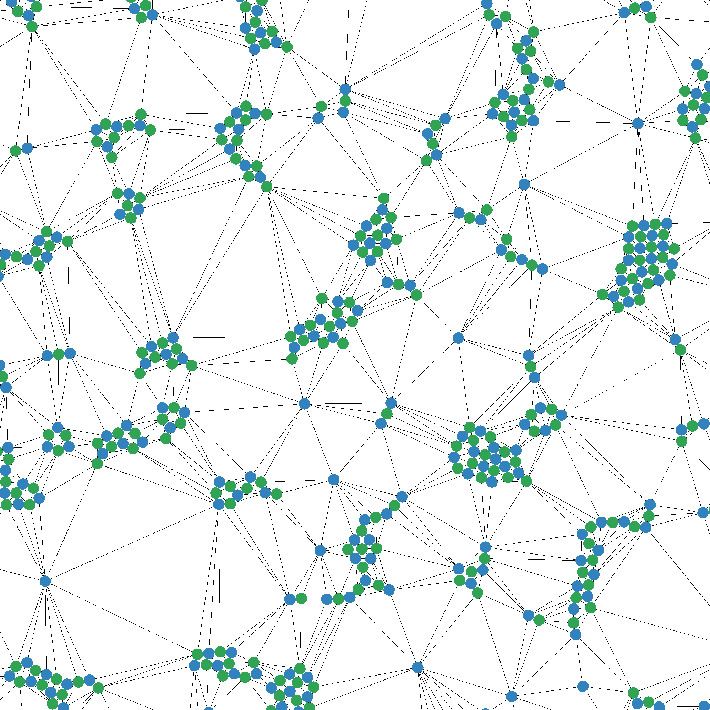
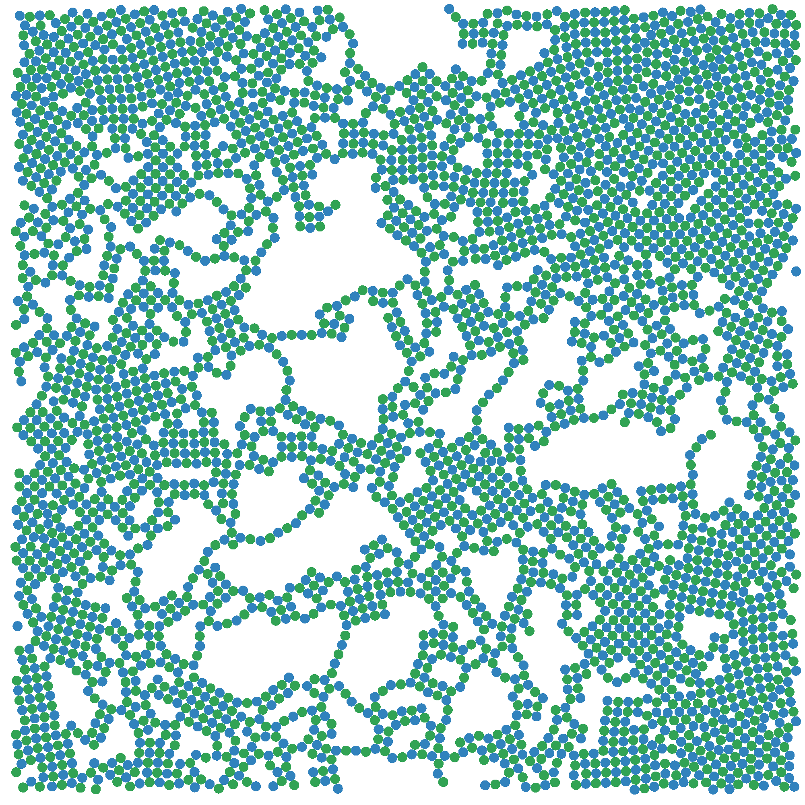
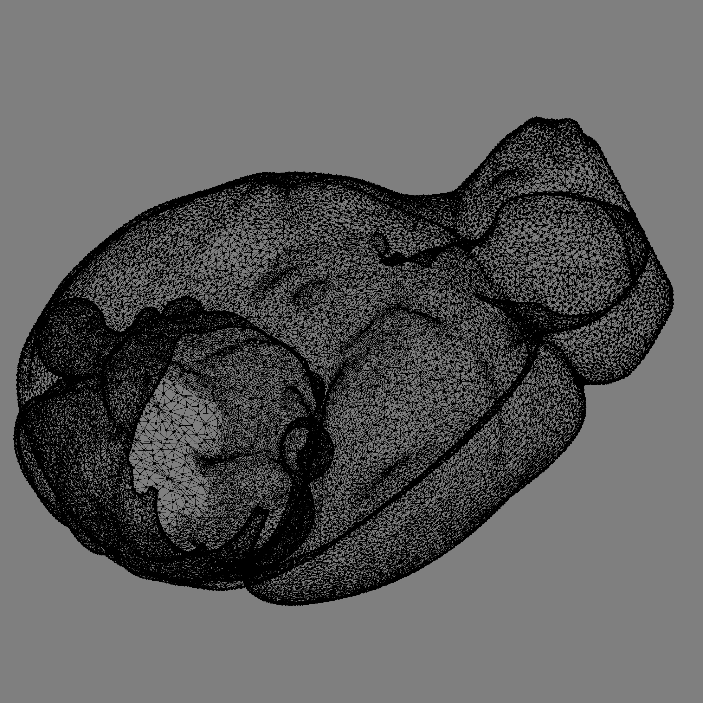
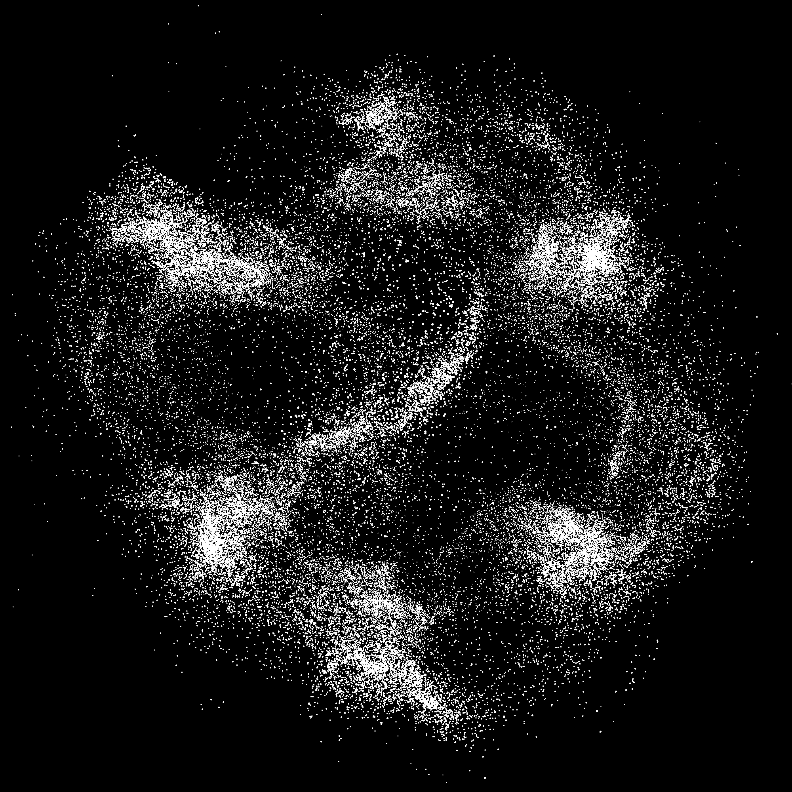
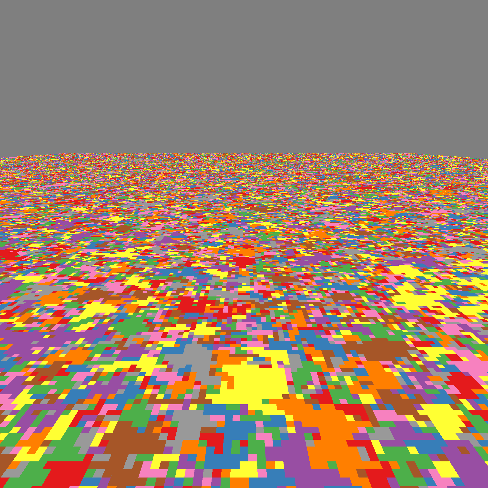
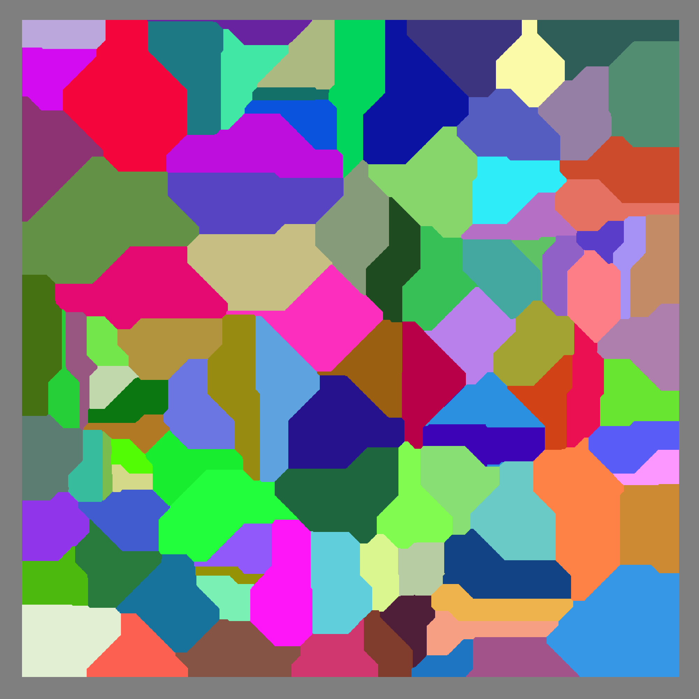

# Mìmir

<p align="center">
  
&nbsp; &nbsp;
  
&nbsp; &nbsp;
  
</p>
<p align="center">
  
&nbsp; &nbsp;
  
&nbsp; &nbsp;
  
</p>


Library for interactive real-time visualization of CUDA code with Vulkan.
Tested on Linux Mint 21.3, with kernel version 5.15.0-139 (more releases coming soon).

## Dependencies

### Platforms
* [Vulkan SDK](https://vulkan.lunarg.com/sdk/home) 1.2 or higher
* [CUDA SDK](https://developer.nvidia.com/cuda-downloads) 10 or higher (for Vulkan interop)

### Libraries
Mìmir downloads additional dependencies via the CMake `FetchContent` command:
* [Slang shading language](https://github.com/shader-slang/slang)
* [ImGui](https://github.com/ocornut/imgui)
* [GLFW](https://github.com/glfw/glfw)
* [GLM](https://github.com/g-truc/glm)

The CMake script will attempt to download and build GLFW from source, which requires having
[additional dependencies](https://www.glfw.org/docs/latest/compile.html#compile_deps_wayland)
installed in the system. This library also uses the
[Vulkan validation layers](https://github.com/KhronosGroup/Vulkan-ValidationLayers),
which may be needed to install separately for some Linux distributions.

## Building

Building from source requires a `C++20` host compiler, `CUDA SDK >= 10.0` and `cmake >= 3.24`.
From the cloned or downloaded source code folder, run:
```cmake
cmake -B build
cmake --build <build_dir> -j
```

The above commands will generate the corresponding makefiles and build the library,
using all available cores to speed up compilation.
Refer to the [CMake documentation](https://cmake.org/cmake/help/latest/manual/cmake.1.html)
for additional command-line settings.

By default, `FetchContent` will attempt to use local installations of the required libraries before
downloading them. This may create issues, for example, when using glm
in [Arch Linux](https://bugs.archlinux.org/task/71987). To override this behavious, pass the
`FETCHCONTENT_TRY_FIND_PACKAGE_MODE=NEVER` option when generating the makefiles.

### Build options

Additional options can be passed with `-D` at the build-system generation step.
The following options are currently provided:

* `CMAKE_BUILD_TYPE` (default `Release`):
Allows selecting the library type to compile. Currently `Debug` and `Release` modes are supported.
* `MIMIR_ENABLE_ASAN` (default OFF):
Enables the address sanitizer [(ASan)](https://github.com/google/sanitizers/wiki/addresssanitizer)
for debugging (slow!). When this option is on, `ASAN_OPTIONS=protect_shadow_gap=0` must be passed
to any program that links to this library to avoid crashed due to interactions with CUDA
[(source)](https://github.com/google/sanitizers/issues/629).
* `MIMIR_BUILD_SLANG` (default OFF):
Compiles the slang library from source for linking with Mìmir instead of using a prebuilt release.
This is slower and more error-prone compared to using the precompiled release,
and historically was used only for debugging slang library calls.
* `MIMIR_BUILD_SAMPLES` (default ON):
Compiles sample programs that demonstrate various features provided by the library.

## Installing

From a successful build placed at `<build_dir>`, run:
```cmake
cmake --install <build_dir> --prefix <install_prefix>
```

By default, this will install the library at the standard system library location. Use the
`--prefix` option to change the installation root folder to `<install_prefix>` (this defaults
to the system library path). Another CMake application can then use `find_package(mimir)` to
link with the installed library. If the library was installed to a non-default path
`<install_prefix>`, run:

```cmake
cmake build -DCMAKE_PREFIX_PATH=<install_prefix>
```

## Using Mìmir

To use the library in code, include the `mimir/mimir.hpp` header, which defines all the
necessary interface. Most Mìmir functions require an instance handle, which is created with
the `createInstance` call. After using the instance, `destroyInstance` must be called to free
all the resources initialized with it.

Once an instance is created, it can be passed to allocation functions to obtain interop-mapped
device memory. `allocLinear` matches a typical `cudaMalloc` call, while `allocMipmapped` can
be used to obtain `cudaArray` handles to opaque memory for usage in CUDA textures.
Allocation functions return the CUDA memory pointer or handle, plus a Mìmir allocation handle.

The `createView` method is the main way to generate visualizations using the library.
This function takes a `ViewDescription` structure which includes a dictionary of
`AttributeDescription` structures, whose `source` fields must point to a initialized
allocation handle.

There are two methods for starting display to screen. The `display` function takes a lambda
function which typically should contain CUDA kernel calls or memory transfers using
interop-mapped memory. This lambda is called a number of times specified as argument in
the function call.

Alternatively, the `displayAsync` function initializes display but returns immediately.
Under this mode, CUDA calls manipulating interop-mapped memory must be enclosed between
the `prepareViews` and `updateViews` function calls respectively. This ensures proper
synchronization and load balancing between rendering and compute work.

### Controls

The following key bindings are available for a Mìmir window:
* `Ctrl-G`: Toggle control panel
* `Ctrl-Q`: Close window

## Running samples

A successful build generates sample programs that link to the compiled library.
From the source root, samples are placed in `build/samples/<sample_name>`
(it is recommended to run the executables from this path so that additional assets).
Example input files for executables that require them (image and mesh viewer)
are included in the `build/samples/assets` folder.
The library currently provides the following samples:

* `run_unstructured`: Displays a 2D brownian moving point cloud with various point sizes.
* `run_structured`: As above, but executing and a Jump Flood Algorithm (JFA) CUDA kernel to compute
a Distance Transform (DT) over a regular structured grid, using point positions as JFA seeds.
* `run_texture [path_to_image]`: Simple image viewer and box filter with periodically varying
radii over the loaded image. Kernel code was ported from the CUDA-Vulkan interop sample program
[vulkanImageCUDA](https://github.com/NVIDIA/cuda-samples/tree/master/Samples/5_Domain_Specific/vulkanImageCUDA).
* `run_mesh [path_to_obj]`: Triangle mesh loader and viewer that uses
[tinyobjloader](https://github.com/tinyobjloader/tinyobjloader) to process `.obj` mesh files.
Smooth per-vertex normals are calculated for the loaded mesh and copied to device memory
along with vertex position and triangle vertex indices.
After that, a CUDA kernel deforms the mesh repeatedly along the normal directions for each vertex,
displaying the results in real time after each kernel call.
* `potts3`: Potts model visualization, based on code by Ferrero et al. (2012). Original source
is available [here](https://github.com/ezeferrero/Potts-Model-on-GPUs)
* `run_colloids [params]`: Visualization of a 2D colloidal particle system with excluded volumes.
The following parameters are recommended (paste as arguments to the run_colloids executable):
    - 4096 0.79 0.01 0.7 1 1 0.3 1 -1
    - 4096 0.52 0.01 0.5 1 1 0.5 -1 -2
    - 4096 0.0873 0.01 0.5 1 1 0.5 -1 -4
* `run_nbody`: Gravitational N-body simulation, based on code from the [CUDA samples repository](https://github.com/NVIDIA/cuda-samples/tree/master/Samples/5_Domain_Specific/nbody), replacing the OpenGL backend with Mìmir.

## Current features

* Visualization of structured and non-structured data:
    - 2D/3D Particle simulations
    - 2D/3D Stencil like simulations such as celullar automata, FDM, Potts model, etc.
    - 2D/3D surface meshes
* Synchronous and asynchronous (on separate thread) rendering
* Camera manipulation
* Model transformations (translation, rotation, scale) per view