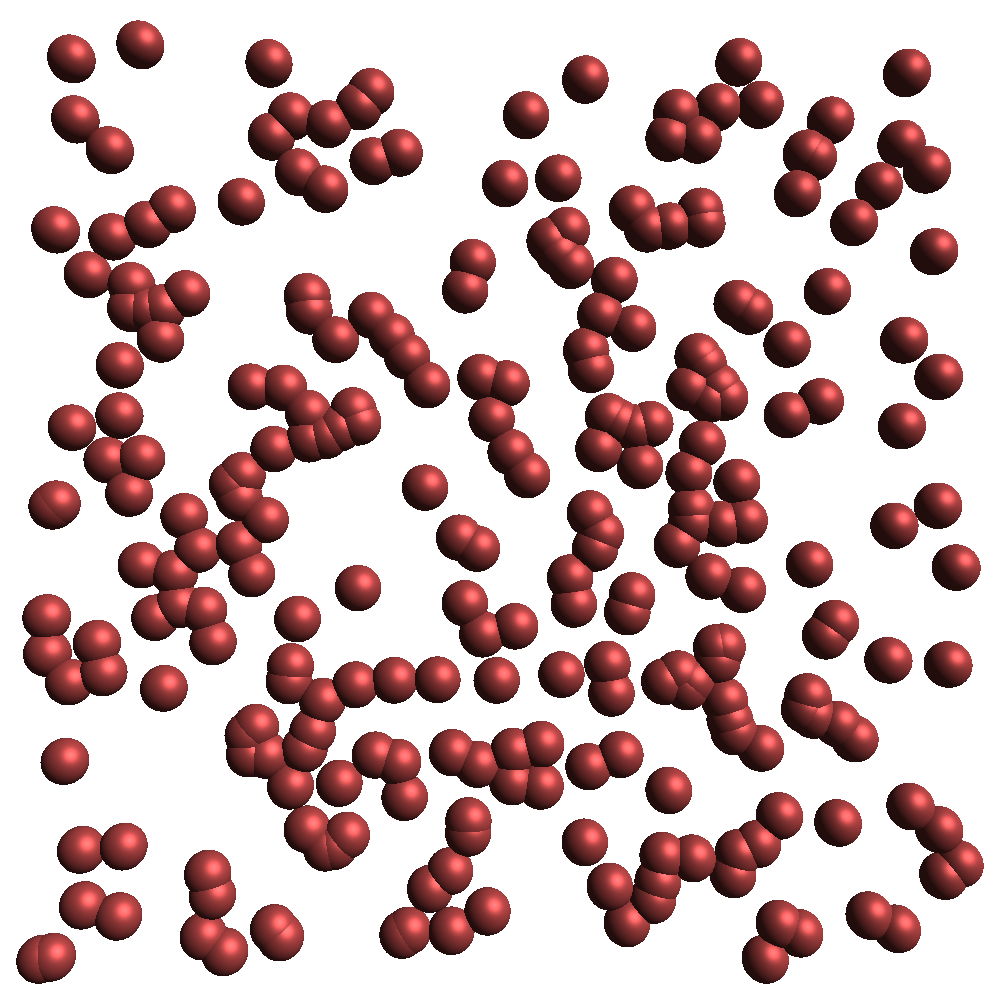
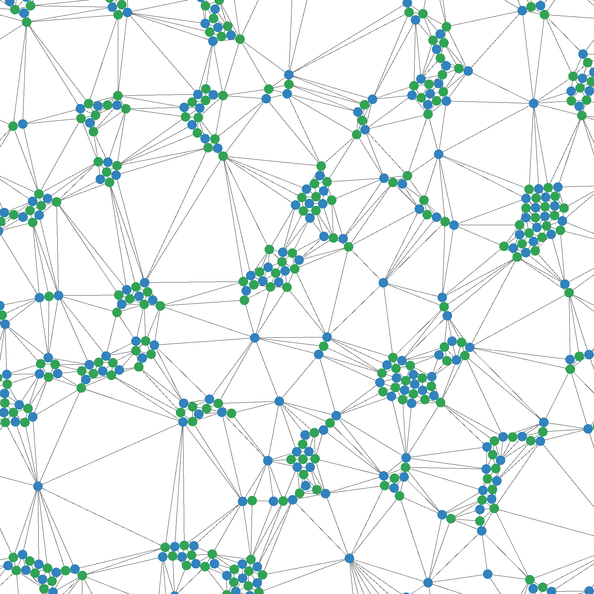
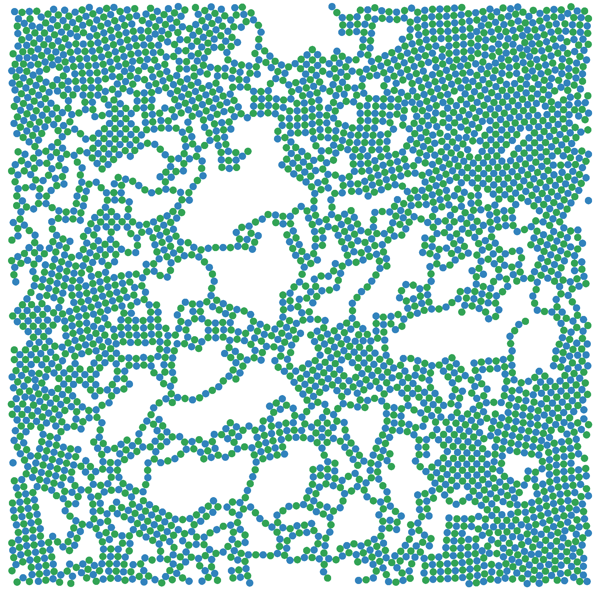
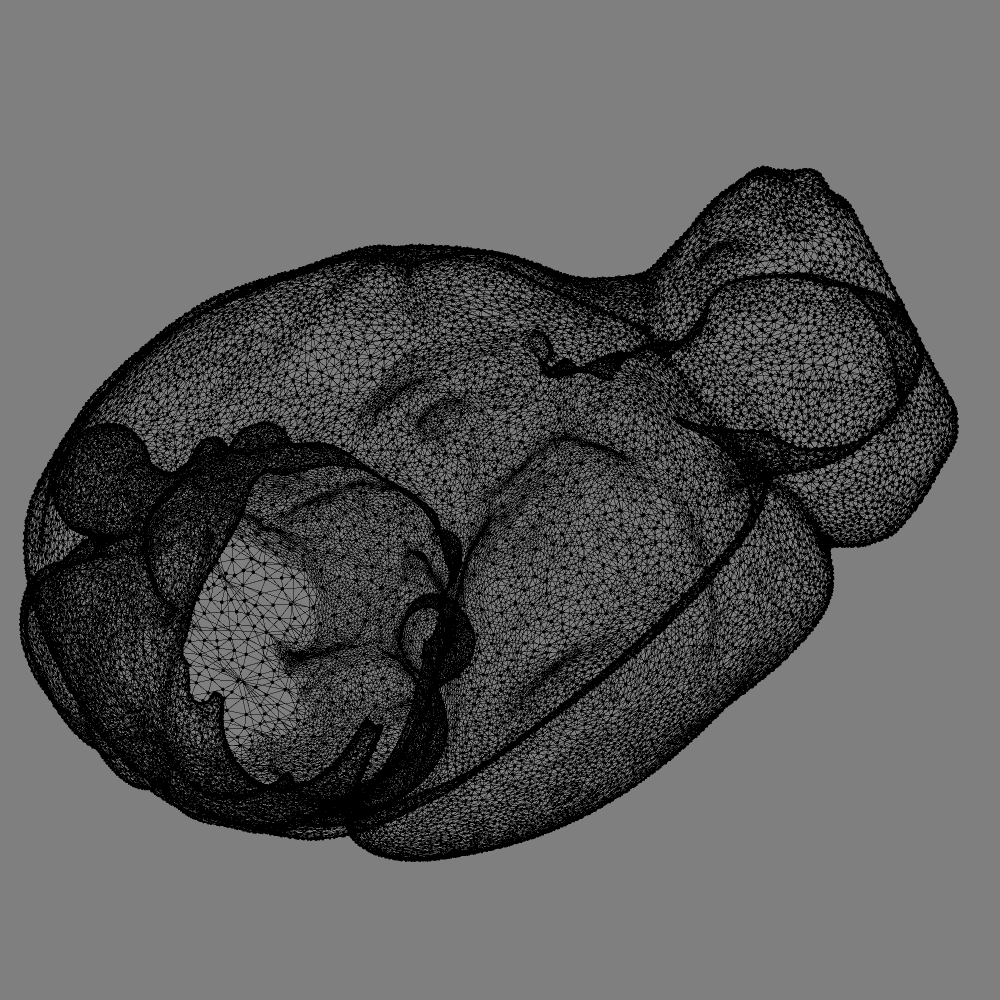
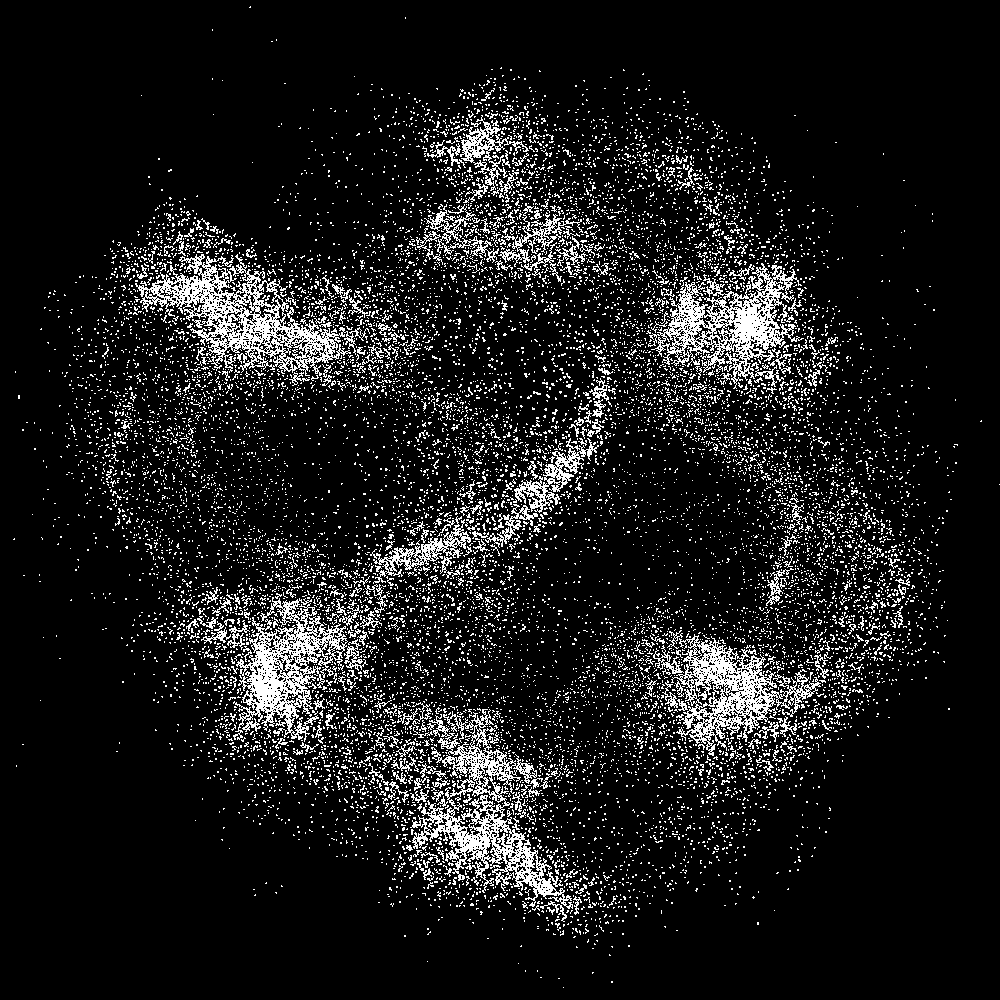
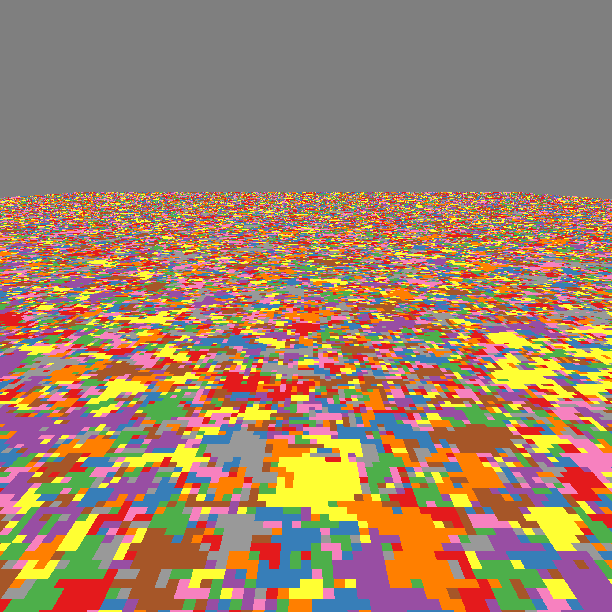
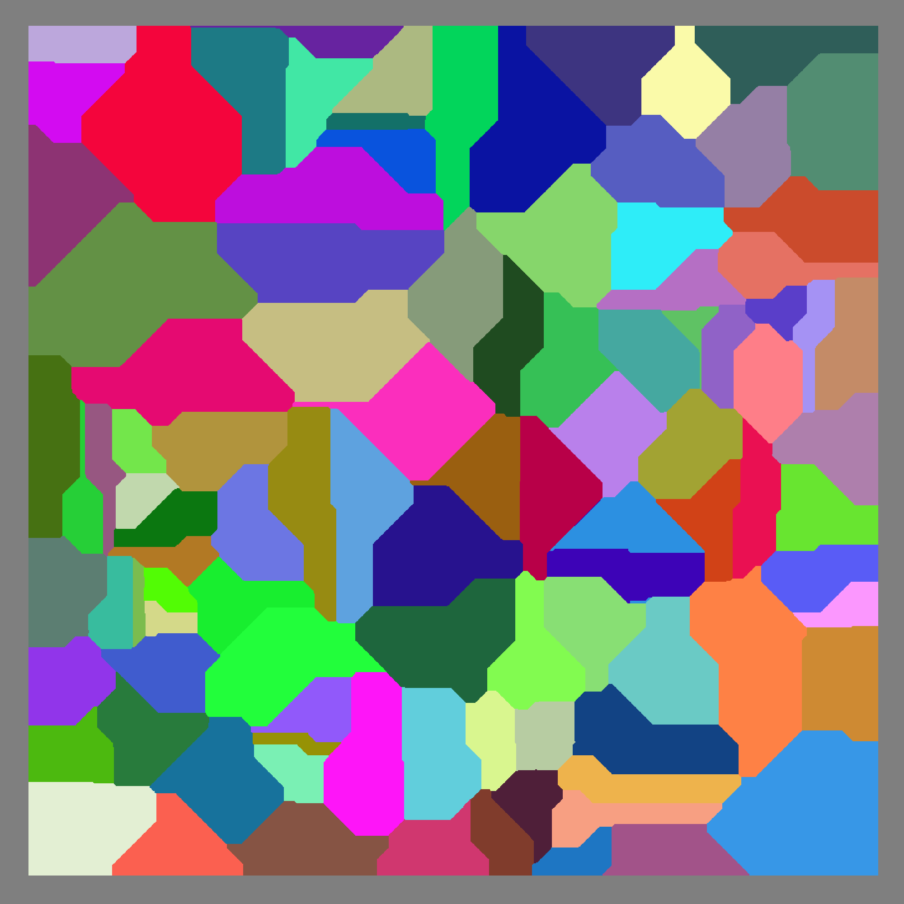

# Mìmir

<p align="center">
  
&nbsp; &nbsp;
  
&nbsp; &nbsp;
  
</p>
<p align="center">
  
&nbsp; &nbsp;
  
&nbsp; &nbsp;
  
</p>
<p align="center">
  
&nbsp; &nbsp;
  
&nbsp; &nbsp;
  
</p>


Library for interactive real-time visualization of CUDA code with Vulkan.
Tested on Linux Mint 21.3 (kernel 5.15.0-139) and Arch Linux (kernel 7.0.10-arch1-1, CUDA 13.3).

## Dependencies

### Platforms
* [Vulkan SDK](https://vulkan.lunarg.com/sdk/home) 1.2 or higher
* [CUDA SDK](https://developer.nvidia.com/cuda-downloads) 10 or higher (for Vulkan interop)

### Libraries
Mìmir downloads additional dependencies via the CMake `FetchContent` command:
* [Slang shading language](https://github.com/shader-slang/slang)
* [ImGui](https://github.com/ocornut/imgui)
* [GLFW](https://github.com/glfw/glfw)
* [GLM](https://github.com/g-truc/glm)

The CMake script will attempt to download and build GLFW from source, which requires having
[additional dependencies](https://www.glfw.org/docs/latest/compile.html#compile_deps_wayland)
installed in the system. This library also uses the
[Vulkan validation layers](https://github.com/KhronosGroup/Vulkan-ValidationLayers),
which may be needed to install separately for some Linux distributions.

## Building

Building from source requires a `C++20` host compiler, `CUDA SDK >= 10.0` and `cmake >= 3.24`.
From the cloned or downloaded source folder, run:

```sh
./mimir-build-from-zero.sh
```

**Or, manually:**
```sh
cmake -B build
cmake --build build -j
```

> **GCC compatibility:** CUDA supports GCC up to a maximum version per release. Check yours with
> `nvcc --version` and use `--gcc <N>` (script) or `-DCMAKE_CUDA_HOST_COMPILER=/usr/bin/g++-<N>`
> (cmake) if your default GCC exceeds it. For the authoritative table see the
> [NVIDIA CUDA Installation Guide](https://docs.nvidia.com/cuda/cuda-installation-guide-linux/).
>
> | CUDA | Max GCC |
> |---|---|
> | 12.0 – 12.2 | 12 |
> | 12.3 – 12.6 | 13 |
> | 13.x | 14 |
>
> _Arch Linux as of June 2026 defaults to GCC 16 with CUDA 13.x — use `--gcc 14`._

Run `./mimir-build-from-zero.sh --help` to see all script options. For full cmake options refer
to the [CMake documentation](https://cmake.org/cmake/help/latest/manual/cmake.1.html).

By default, `FetchContent` will attempt to use local installations of the required libraries before
downloading them. This may create issues, for example, when using glm
in [Arch Linux](https://bugs.archlinux.org/task/71987). To override this behaviour, pass
`-DFETCHCONTENT_TRY_FIND_PACKAGE_MODE=NEVER` on the cmake line.

### Build options

Additional options can be passed with `-D` at the build-system generation step.
The following options are currently provided:

* `CMAKE_BUILD_TYPE` (default `Release`):
Allows selecting the library type to compile. Currently `Debug` and `Release` modes are supported.
* `MIMIR_ENABLE_ASAN` (default OFF):
Enables the address sanitizer [(ASan)](https://github.com/google/sanitizers/wiki/addresssanitizer)
for debugging (slow!). When this option is on, `ASAN_OPTIONS=protect_shadow_gap=0` must be passed
to any program that links to this library to avoid crashed due to interactions with CUDA
[(source)](https://github.com/google/sanitizers/issues/629).
* `MIMIR_BUILD_SLANG` (default OFF):
Compiles the slang library from source for linking with Mìmir instead of using a prebuilt release.
This is slower and more error-prone compared to using the precompiled release,
and historically was used only for debugging slang library calls.
* `MIMIR_ENABLE_REMOTE` (default OFF):
Enables H.264 (NVENC) encoding for the remote-rendering server, via system ffmpeg. Without it the
server streams uncompressed frames. See [Remote rendering](#remote-rendering).
* `MIMIR_ENABLE_QUIC` (default OFF):
Enables the QUIC transport (UDP + TLS) for remote rendering, via system ngtcp2. Without it the
server is TCP-only. See [Remote rendering](#remote-rendering).
* `MIMIR_RR_CLIENT_ONLY` (default OFF):
Builds **only** the remote-rendering client — the thin viewer that connects to a mimir server
and displays its simulation (the sample's `rr-client`, installed as `mimir-client`). The library
and everything server-side are skipped, so no CUDA toolkit, Vulkan, or NVIDIA hardware is needed.
For machines that just view a remote server (ultrabooks, AMD/Intel-graphics laptops). See
[Viewer on a machine without NVIDIA/CUDA](#viewer-on-a-machine-without-nvidiacuda).

## Installing

From a successful build placed at `<build_dir>`, run:
```cmake
cmake --install <build_dir> --prefix <install_prefix>
```

By default, this will install the library to the standard system path. Use `--prefix` to install
elsewhere. After installing, samples and other CMake projects can find mimir via the `MIMIR_DIR`
environment variable — see [`samples/README.md`](samples/README.md).

## Using Mìmir

To use the library in code, include the `mimir/mimir.hpp` header, which defines all the
necessary interface. Most Mìmir functions require an instance handle, which is created with
the `createInstance` call. After using the instance, `destroyInstance` must be called to free
all the resources initialized with it.

Once an instance is created, it can be passed to allocation functions to obtain interop-mapped
device memory. `allocLinear` matches a typical `cudaMalloc` call, while `allocMipmapped` can
be used to obtain `cudaArray` handles to opaque memory for usage in CUDA textures.
Allocation functions return the CUDA memory pointer or handle, plus a Mìmir allocation handle.

The `createView` method is the main way to generate visualizations using the library.
This function takes a `ViewDescription` structure which includes a dictionary of
`AttributeDescription` structures, whose `source` fields must point to a initialized
allocation handle.

There are two methods for starting display to screen. The `display` function takes a lambda
function which typically should contain CUDA kernel calls or memory transfers using
interop-mapped memory. This lambda is called a number of times specified as argument in
the function call.

Alternatively, the `displayAsync` function initializes display but returns immediately.
Under this mode, CUDA calls manipulating interop-mapped memory must be enclosed between
the `prepareViews` and `updateViews` function calls respectively. This ensures proper
synchronization and load balancing between rendering and compute work.

### Controls

The following key bindings are available for a Mìmir window:
* `Ctrl-G`: Toggle control panel
* `Ctrl-Q`: Close window

## Samples

Samples are built separately from the library. Full build instructions — including how to
point samples at the library, build all or just one, and run them — are in
[`samples/README.md`](samples/README.md).

## Remote rendering

Mìmir can render headless on a GPU server and stream the result to a thin native client over the
network (H.264 over QUIC or TCP), with the client sending camera/pause interaction back — e.g. a
laptop driving a visualization that runs on a remote GPU box. Full details, deployment notes (auth
token, SSH tunnel), and controls are in
[`samples/remote-rendering/README.md`](samples/remote-rendering/README.md).

**Extra dependencies** (only for this feature): ffmpeg (H.264) and ngtcp2 + OpenSSL (QUIC). On
Arch: `pacman -S ffmpeg libngtcp2 openssl`.

**Step 1 — build the library** with the feature flags:
```sh
./mimir-build-from-zero.sh --remote --quic   # add --gcc 14 on Arch Linux / GCC 16 systems
```
**Or, manually:**
```sh
cmake -B build -DMIMIR_ENABLE_REMOTE=ON -DMIMIR_ENABLE_QUIC=ON
cmake --build build -j
```

**Step 2 — build the remote-rendering sample:**
```sh
./samples-build-from-zero.sh --sample remote-rendering   # add --gcc 14 if used in step 1
```
**Or, manually:**
```sh
cmake -B samples/remote-rendering/build -S samples/remote-rendering/ -Dmimir_DIR=$(pwd)/build/lib/mimir
cmake --build samples/remote-rendering/build -j
```

**Step 3 — run** from the build folder — server on the GPU box, client on the viewing machine:
```sh
cd samples/remote-rendering/build

# server: H.264 over QUIC, 1280x720, 50k points
./rr-server 9000 1280 720 50000 1 quic
# client: prefers QUIC, falls back to TCP automatically
./rr-client <server-ip> 9000
```
For a quick local test, run both on one machine with `127.0.0.1`. Through an SSH tunnel
(`ssh -L 9000:localhost:9000 user@host`) force TCP: `./rr-server 9000 1280 720 50000 1 tcp` and
`./rr-client 127.0.0.1 9000 "" tcp`. Without the feature flags the server still builds and streams
raw frames over TCP.

### Reusable viewer: `mimir-client`

The client is **workload-agnostic** — it depends only on the wire protocol, not on what the server
renders. The build also produces a standalone **`mimir-client`** (same program as the sample's
`rr-client`) that `cmake --install` places on your `PATH`. So to build your own remote app you only
write the **server** (`RenderMode::Headless` + `serveRemote(...)`) — then view it with the existing
client, no client code of your own:
```sh
cmake --install build --prefix ~/.local   # installs lib + mimir-client
mimir-client <server-ip> 9000              # views ANY mimir serveRemote() server
```
It exposes the controls common to every mimir scene (orbit / zoom / pan / pause). (Disable with
`-DMIMIR_BUILD_CLIENT=OFF`.)

### Viewer on a machine without NVIDIA/CUDA

The viewer needs **no CUDA toolkit, Vulkan, NVIDIA hardware, or the mimir library** — only ffmpeg,
ngtcp2 + OpenSSL, and GLFW/OpenGL (on Arch: `pacman -S ffmpeg libngtcp2 openssl glfw`). So any
Linux laptop (Intel/AMD graphics included) can build just the viewer:

```sh
./mimir-build-from-zero.sh --rr-client-only
```
**Or, manually:**
```sh
cmake -B build -DMIMIR_RR_CLIENT_ONLY=ON
cmake --build build -j
./build/mimir-client <server-ip> 9000
```

The same flag works on the sample (`./samples-build-from-zero.sh --rr-client-only` builds only
`rr-client`). H.264 decoding falls back to ffmpeg's software decoder when there is no NVDEC, so an
integrated GPU is enough.

## Current features

* Visualization of structured and non-structured data:
    - 2D/3D Particle simulations
    - 2D/3D Stencil like simulations such as celullar automata, FDM, Potts model, etc.
    - 2D/3D surface meshes
* Synchronous and asynchronous (on separate thread) rendering
* Camera manipulation
* Model transformations (translation, rotation, scale) per view
* Headless rendering and [remote rendering](#remote-rendering) (H.264 over QUIC/TCP to a thin client)